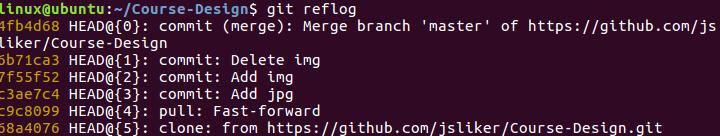

## 初识git

### 介绍

GIT 是一个分布式版本控制软件，最初由林纳斯·托瓦兹（Linus Torvalds）创作，于2005年以GPL发布。最初目的是为更好地管理Linux内核开发而设计。是目前世界上最先进的分布式版本控制系统.

### git的安装

使用下面的命令在Linux系统下安装git工具.
```
$ sudo apt-get install git
```

### 创建版本库

什么是版本库呢？版本库又名仓库，英文名repository，你可以简单理解成一个目录，这个目录里面的所有文件都可以被Git管理起来，每个文件的修改、删除，Git都能跟踪，以便任何时刻都可以追踪历史，或者在将来某个时刻可以“还原”。

第一步, 先要创建一个目录, 这个目录就是用来存放仓库的.

```
$ mkdir html
$ cd html
```

第二步, 使用git init命令, 将当前目录创建成git仓库.

```
$ git init
Initialized empty Git repository in /home/user/html/.git/
```

马上就把仓库创建成功了, 并提示这是一个空仓库.

```
$ ls -al
.git
```

**注意.git目录及里面的东西不要随便更改，因为这有可能导致你的仓库被删除！！！！！**

### 增加文件

提交前需要先把需要关注它修改有文件或是需要提交到仓库的文件加到管理列表里来.

当前目录里没有文件, 那么我们先创建一个文件README.然后编辑这个文件，写点东西

```
1.$ touch README
```

```
2.$ vim README
```

先用查看当前状态的命令, 查看一下现在目录下文件的状态.
```
$ git status
```

把文件加到仓库中去, 只有加到仓库中了, 才可能看一下文件的变化.

```
$ git add README
```

现在使用查看状态的命令, 看一下是目录下文件的状态.

```
$ git status
```

### 提交

```
$ git commit
```

### 配置用户信息

配置用户名, 这个用户名是你的提交patch的名子, 最好写真的名了, 不是网名, 如果有一天你成为名人了,那这个东西会一直印着你的足迹.
```
$ git config --global user.name
```

配置用户邮箱, 这个邮箱最好写你最常用的邮箱, 说不定会有人给你写邮件的, 这个是可能来自世界的任何角落, 可能是任何肤色和眼睛.

```
$ git config --global user.email
```

配置编辑提交信息的编辑器, 我们熟悉的编辑器是vim. 使用这个去编辑提交信息, 最好把每一次提交信息填写写的全面, 不是为了给别人看, 万一那天自己想回顾一下. 也需要详细的信息.

```
$ git config --global core.editor vim
```

### 查看提交信息

我们刚才学习了提交信息, 那现在查看一下我们提交的信息.

```
$ git log
```

###删除文件恢复

有时候, 我们不小心把文件给删除了. 想恢复这个文件时, 需要用到下面的命令.

我现在把仓库里的README这个文件给删除了. 然后再使用ls命令查看文件, 看看这个文件是否还存在.

```
$ rm README
$ ls
$ ls -al
```

文件已经被删除了, 这是我们使用linux基本命令去查看文件是不是还存在这个目录中.现在我们使用git去查看一下现在仓库是什么状态

```
$ git status
```

发现这个文件是误删了, 我们想把它恢复回来, 现在我们有办法吗? 如果没有将这个文件提交到仓库里, 我们是没有办法将它恢复的.

```
$ git checkout README
```

然后我们再用ls查看一下文件是否存在.

```
$ ls -al
```

再查看git仓库是状态
```
$ git status
```

### 版本回退

什么叫版本, 一次提交就相当于一个版本. 如果更准确的说是提交的回退. 每一次提交都会将修改的状态提交到仓库中保存着, 这些信息都保存那里呢?都保存在.git的目录下.

如果想回退到上次提交的版本, 那么需要使用git reset命令.

```
$ git reset --hard commitID
```

注意: 使用这个命令后,再使用git log命令不会查看到所有log的相关信息, 那么我们没有办法获取到后一个提交的CommitID.

```
$ git log
```

在这里我们需要使用git reflog命令查看后一次提交的CommitID, 如果已经有了后一次提交的CommitID, 那么我们需要使用git reset命令恢复到前面提交版本.

```
$ git reflog
```

参考图片



可通过左侧黄色的commit ID进行版本回退

### 从仓库中删除文件

如果将文件从仓库中删除这个文件, 需要使用git rm.

```
$ git rm filename
```

这只是做了删除操作, 但没有真正的从仓库中删除, 我们只要将删除再做一次提交到仓库.

```
$ git commit
```

### 从版本库中忽略文件

如果在我们的仓库目录里会产生三方的临时垃圾文件或是

```
$ touch .gitignore
```

### 版本之间对比

$ git diff

$ git diff commitID1 commitID2

## 简述patch

patch多指补丁的意思, 在这里更多的指程序有一些bug, 需要我们进行fixed, 那fixed源码文件就是patch.

patch实际上是保存两个文件的差异.

### git生成patch

```
$ git format-patch -p1
```

### git 打patch

```
$ git am patch-name
```

