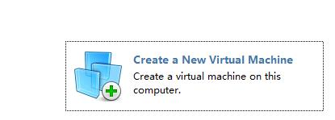

## Diary of Linux

### 在VMware工具里安装Linux系统ubuntu

可在官方网址下载

http://www.ubuntu.org.cn/index_kylin

通过以下按钮



来构建一个虚拟机，然后倒入Ubuntu的iso文件进行安装，具体过程略

### 初识vim编辑工具

#### 介绍
Vim是一个类似于Vi的著名的功能强大、高度可定制的文本编辑器，在Vi的基础上改进和增加了很多特性。Vim是纯粹的自由软件在代码补全、编译及错误跳转等方便编程的功能特别丰富，在程序员中被广泛使用，和Emacs并列成为类Unix系统用户最喜欢的文本编辑器。

#### vim的安装

使用下面的命令在Linux系统下安装vim工具.
```
$ sudo apt-get install vim
```

#### vim的基本使用

* i：在当前字符的左边插入
* I：在当前行首插入
* a：在当前字符的右边插入
* A：在当前行尾插入
* o：在当前行下面插入一个新行
* O：在当前行上面插入一个新
* h: 向前移动一个字符
* j: 向上移动一行
* k: 向下移动一行
* l: 向后移动一个字符
* yy: 复制当前一行
* dd:剪切当前一行
* p: 粘贴内容到游标之后
* P: 粘贴内容到游标之前

#### 基本的文件使用

* 文件的创建、删除、复制、重命名、移动
* 列出文件列表
* 查看文件内容

#### 例如

```
touch  file
cp file file1
cp file  /home/linux/file1
mv file   file2
mv file  /home/linux/
ls -al  .
cat  file
```

#### 基本的目录操作

* 目录的创建、删除、复制、重命名、移动
* 列出目录列表
* 目录中查找文件

#### 例如

```
mkdir dir
cp dir   dir1  -a
cp dir   /home/linux/dir2  -a
mv dir  dir2
mv dir  /home/linux/
rm  dir  -rf
ls -d  dir
find  ./dir  -name  "filename"
```
